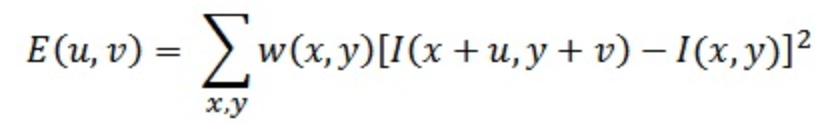

# Harris corner

## Giới thiệu
Trong các bài toán của thị giác máy bài toán matching các điểm qua các frame hoặc views là một trong những bài toán kinh điển. Với những thông tin matching đó chúng ta có thể làm được nhiều việc. Ví dụ như biết được các điểm tương ững giữa 2 frames, views. Để làm được việc này ta phải tìm các đặc trưng. Và đặc trưng tốt nhất chính là góc (corner). Bởi mỗi góc (corner) của một vật thể nhiều khả năng là duy nhất. Thứ 2 là góc nó sẽ bất biến với việc khi bức ảnh bị dịch chuyển (trái, phải, chéo..). Và phần dưới là một trong những thuật toán kinh điển và đơn giản để tìm đặc trưng góc của một ảnh được gọi là Harris Corner Detector.

**Ý tưởng** của thuật toán này là tìm 1 vùng nhỏ của một bức ảnh mà nó sẽ bị biến đổi lớn khi di chuyển vùng nhỏ đó xung quanh. Ví dụ như hình ảnh bên dưới. Giả sử có 1 vùng nhỏ màu đỏ. Khi vùng nhỏ này di chuyển xung quanh thì giá trị độ lơn cường độ các pixel trong vùng nhỏ đó biến đổi rất mạnh. Còn vùng nhỏ xanh lá cây khi di chuyển xung quanh thì giá trị độ lớn cường độ các pixcel trong vùng nhỏ đó dường như ko thay đổi. Còn vùng nhỏ xanh da trời thì sẽ không có biến động gì nếu vùng nhỏ đó di chuyển dọc theo ô bàn cờ, còn sẽ có biến động mạnh nếu di chuyển theo chiều ngang

## Công thức hóa ý tưởng

Từ ý tường trên ông Harris đã mô hình hóa nó thành công thức toán học như sau:

Trong đó:
* **E**: là giá trị khác nhau giữa cửa sổ gốc và cửa sổ đã được di chuyển xung quanh.
* **u**: là khi cửa sổ dịch chuyển u pixels theo chiều trục x.
* **v**: là khi cửa sổ dịch chuyển v pixels theo chiều trục y.
* **w(x, y)**: là khi cửa sổ ở vị trí x, y.
* **I(x, y)**: là cường độ ở vị trí x, y.

Vậy ta cần tìm một sửa sổ mà có **E** có giá trị lớn nhất. **E** lớn chứng tỏ khi di chuyển cửa sổ xung quanh thì biến động nó mạnh.

Vậy nên cần cực đại hóa hàm:

Tuy nhiên để đơn giản hơn trong việc cực đại hóa hàm **E** thì ta sẽ áp dụng chuỗi Taylor để sấp xỉ hàm này bằng một hàm đơn giản hơn.

Ta khai triển hàm này sẽ được biểu thức:

Và viết gọn lại ta được:

Đặt **M** bằng tổng ma trận kia ta được:

Điều thú vị tác giả nhận thấy là giá trị riêng của ma trận **M** có thể giúp tìm được cửa sổ tốt nhất

Với R lớn hơn 1 giá trị cụ thể thì vùng của số đấy chứa góc (corner).

Từ mà trận trên tác giả suy ra được:
- R nhỏ khi cả lamda1 và lamda2 cùng nhỏ => nó là vùng phẳng
- R < 0 khi lamda1 lớn hơn rất nhiều lamda2 hoặc ngược lại => Nó là vùng cạnh
- R lớn khi cả 2 lamda1 và lamda2 cùng lớn => nó là vùng góc.

Và hình ảnh dưới thể hiện toàn bộ thuật toán của Haris.

