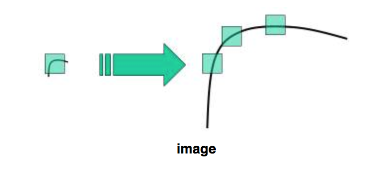
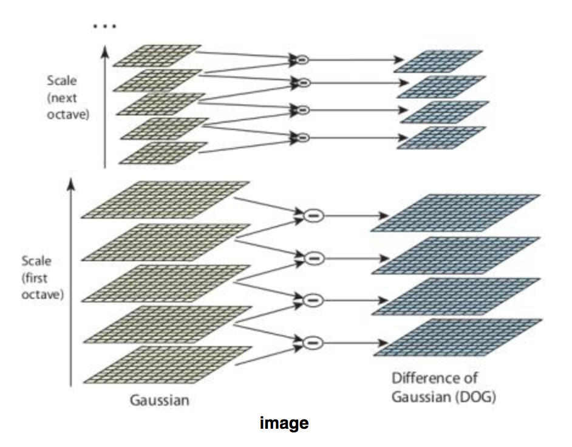
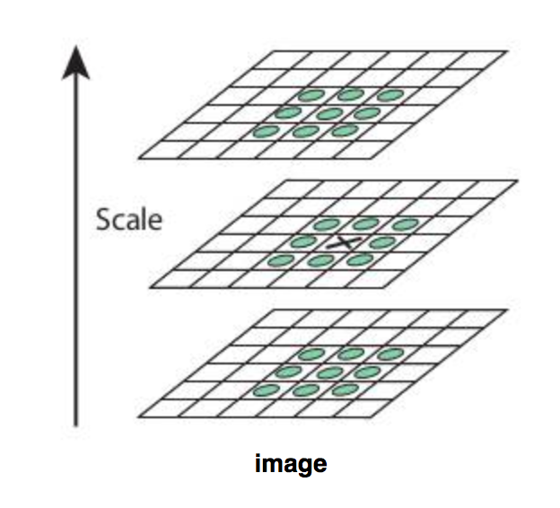
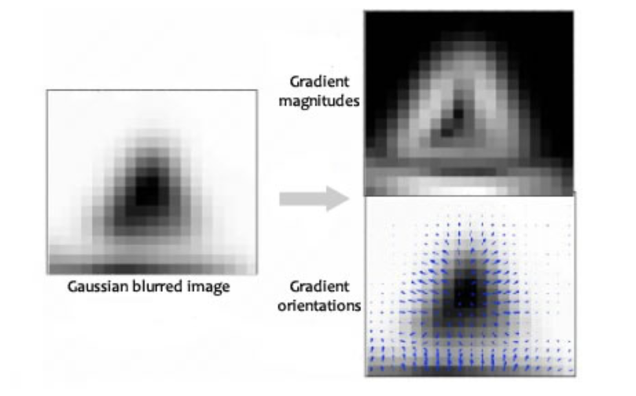
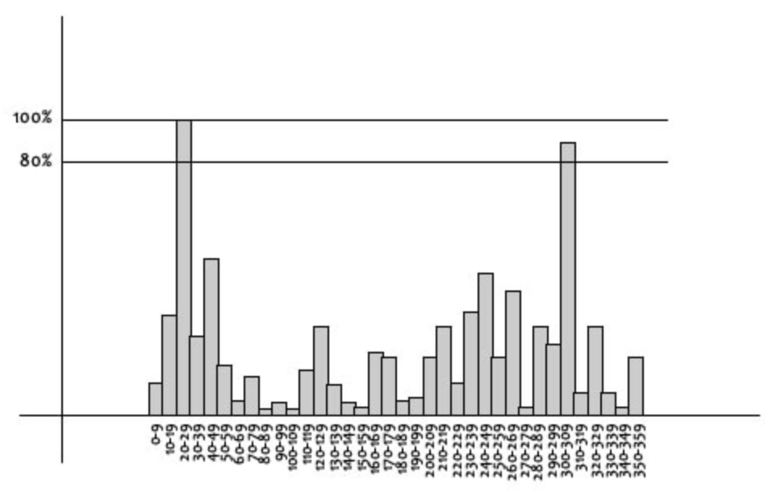
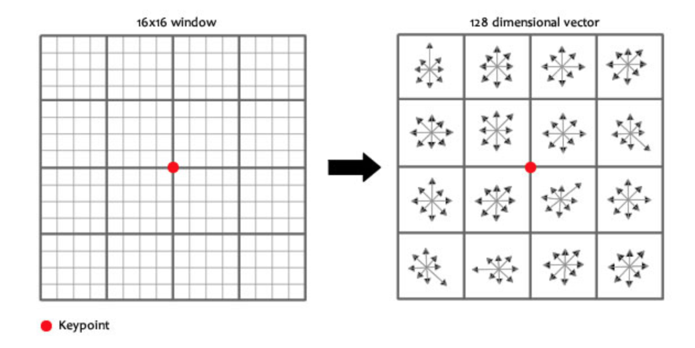

# SIFT (Scale Invariant Feature Transform)

## Giới thiệu

Thuật toán Harris-Corner là một trong những thuật toán rất tốt để phát hiện góc. Thuật toán này bất biến với việc khi ảnh bị quay. Thuật toán sẽ tìm được cùng đặc trưng góc trong cả 2 ảnh quay và không quay. Khi bức ảnh bị dịch cũng không ảnh hưởng. Tuy nhiên nếu chúng ta phóng to ảnh thì sao? liệu rằng thuật toán Harris-Corner còn tốt không. Câu trả lời chắc chắn là không bởi vì để tìm được góc trong một ảnh được phóng to lên thì cũng cần có cửa sổ to hơn để tìm đặc trưng. Nếu dùng với của sổ nhỏ hơn với bức ảnh được phóng to thì thuật toán sẽ hiểu đó là đường thẳng như hình bên dưới

Vậy nên thuật toán Harris Corner không bất biến với scale (phóng ảnh). Đó cũng là lý do một thuật mới được tạo ra bởi D.Lowe năm 2004. Thuật toán có tên là Scale Invariant Feature Transform (SIFT).

## Nội dung

Thuật toán SIFT có những cải tiến mới so với Harris Corner. Và chúng ta sẽ tìm hiểu từng phần một

### 1. Scale-space Extrema Detection (Phát hiện điểm cực trị Scale-space)
Từ thuật hình ảnh trên chúng ta biết rằng không thể sử dụng cùng cửa sổ để phát hiện đặc của bức ảnh với tỉ lệ khác nhau. Nó ổn với góc nhỏ nhưng với góc lớn chúng ta lại cần cửa sổ lớn hơn. Chính vì vậy bộ lọc theo tỉ lệ không gian được áp dụng. Trong đó Laplace Of Gaussian (LoG) được sử dụng cho ảnh với các giá trị __sigma__ khác khau. Khi giá trị **sigma** lớn thì cửa sổ filter lớn nên sẽ phát hiện được góc lớn và ngược lại. Từ đó ta có thể tìm được các điểm cực trị địa phương với các giá trị **sigma** khác nhau.

Tuy nhiên việc tính toán (LoG) khá tốn kém nên thay vì dùng LoG thì tác giả dùng (Differnce of Gaussian) DoG mà kết quả của nó sấp xỉ với LoG nhưng chi phí tính toán sẽ rẻ hơn rất nhiều.

Người ta sẽ tính DoG bằng cách lấy hiệu của 2 bức ảnh đã đã được làm mờ với của sổ lọc gaussian có tham số lần lượt là **sigma**, **k*sigma**

DoG sẽ được tính trong một Octave. Octave đầu sẽ có kích cỡ bằng ảnh gốc. Nhưng sẽ có tham số **sigma** khác nhau. Octave tiếp theo sẽ có kích thước ảnh nhỏ hơn 1 nửa so với ban đầu và các tham số **sigma** khác nhau. Cứ như vậy ta sẽ có một mô hình giống như kim tự tháp.

Trong đây tác giả dùng 4 Octave và có 5 mức làm mờ với các tham số **k=sqrt(2)**, **sigma=1.6**.

Điểm cực trị địa phương sẽ được tìm bằng cách từ một pixel trong ảnh sẽ so sánh với 8 điểm xung quanh và 9 điểm trên và 9 điểm dưới như trong hình mô tả. Điểm có giá trị lớn nhất sẽ được coi là điểm đặc trưng tiềm năng (a potential keypoint).

### 2. Định vị điểm đặc trưng

Sau bước trên ta sẽ thấy rằng sẽ có nhiều điểm đặc trưng tiềm năng và chúng ta cần tăng độ chính xác vị trí các điểm đặc trưng tìm được bằng cách:
- Sử dụng chuỗi Taylor mở rộng để thể định vị chính xác điểm đặc trưng, loại bỏ các vùng phẳng (flat region). Nếu cường độ của điểm đặc trưng nhỏ hơn ngưỡng (tác giả chọn ngường 0.03) thì sẽ không được coi là điểm đặc trưng nữa.

- Ngoài ra ta thấy rằng các cạnh của vật thể trong ảnh sẽ tạo thành 1 dãy điểm cực trị. Và chúng ta cũng cần loại bỏ các cạnh đó (remove edges), chỉ giữ lại mỗi vùng góc. Từ ý tưởng của Harris. tác giả sẽ dùng một cửa sổ lọc để loại bỏ hết các cạnh.

Thấy rằng để định ví chính xác điểm đặc trưng tác giả đã loại bỏ các vùng phẳng ( remove flat regions) và loại bỏ các cạnh (remove edges)

### 3. Xác định hướng điểm đặc trưng.

Sau 2 bước trên thì đặc trưng có thể bất biến khi thay đổi tỉ lệ ảnh, hay dịch chuyển ảnh. Và bước này giúp cho điểm đặc trưng bất biến với việc xoay ảnh.

Ý tưởng chính của bước này là sẽ thu thập hướng và độ lớn của tất cả các điểm xung quanh của điểm đặc trưng. Từ đó sẽ phát hiện ra được hướng và độ lớn của vùng đó. Chúng ta sẽ gán hướng đó cho điểm đặc trưng.

Từ việc tập hợp hướng của các điểm xung quanh của các điểm đặc trưng thì chúng ta sẽ tạo được một histogram 360 độ với 36 bins.

Ta thấy rằng trên biểu đồ góc có giá trị 20-29 đạt giá trị cao nhất vậy nên ta có thể gán hướng của đặc trưng này là 3 (bin thứ 3). Bất kì bin nào có giá trị trên 80% bin cao nhất thì sẽ được cho là điểm đặc trưng mới với độ lớn, vị trí giống đặc trưng cũ tuy nhiên lại có hướng khác.

### 4. Keypoint Descriptor

Ý tưởng chính của phần này là sẽ định danh các keypoint bằng Keypoint Descriptor. Ví dụ nếu mắt là một điểm đặc trưng thì có thể dùng điểm đặc trưng này để phân biệt với các điểm đặc trưng khác như mũi, miệng...

Để có thể tạo ra một Keypoint Descriptor thì sẽ dùng 1 cửa sổ 16x16 quanh điểm đặc trưng và được chia ra làm 16 cửa sổ nhỏ hơn nữa với kích cỡ 4x4

Trong mỗi cửa sổ nhỏ 4x4 ta sẽ xác định hướng và độ lớn. Từ đó đưa vào một histogram 8 bin. Hiểu đơn giản mỗi cửa sổ nhỏ 4x4 sẽ được biểu diễn bởi vector 8 hướng.

Từ đó số chiều của mỗi descriptor là 4x4x8 = 128 chiều.
4x4 cửa sổ nhỏ và 8 hướng trong mỗi cửa sổ đó.

