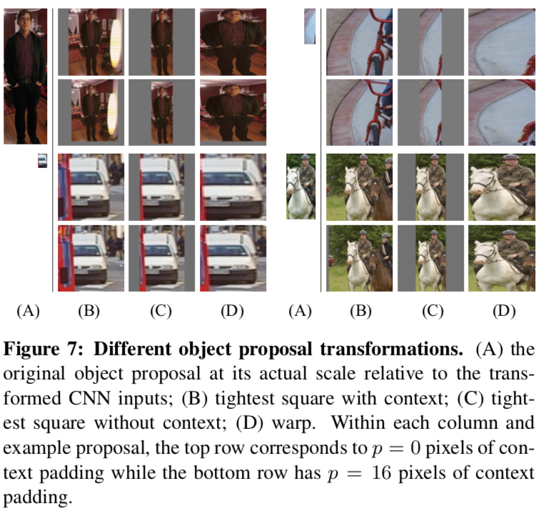

# Note R-CNN

## Tư tưởng

R-CNN được đặt tên như này vì họ kết hợp `region proposals`(các vùng đề xuất) với CNN. R-CNN là một thuật toán detect đơn giản và hiệu quả mà nó có [mAP]() hơn phương pháp cũ tốt nhất (53.3%) là hơn 30%. Trong bài báo họ có 2 đóng góp quan trọng:
    - Áp dụng CNN vào các `region proposals` để localize và segment các đối tượng.
    - Khi mà dữ liệu có nhãn mà ít, họ sẽ pre-training trước khi fine-tuning trên miền cụ thể sau.

Thuận toán R-CNN có 4 gia đoạn chính sau:

Ảnh đầu vào -> Trích xuất ra các `region proposal` (~2k) -> đưa các `region proposal` vào mạng CNN để lấy ra các đặc trưng -> bằng SVM thì các đặc trưng được phân loại ra thuộc lớp nào.

Như ảnh minh họa bên dưới.

## Các phương pháp trước đó
Trong bài báo có nhắc đến 2 thuật toán detect rất hiệu quả trước đó là SIFT và HOG. 2 thuật toán này đều lấy histograms theo hướng của các blockwise.

Từ 1 ảnh -> SIFT -> Keypoint -> Descriptor (128 chiều).

Mỗi descriptor bao gồm:
    - Tọa độ keypoint.
    - Độ dài và hướng của keypoint.
    - Descriptor (128 chiều).

Tại sao lại 128 chiều?

Mỗi blockwise sẽ có size 16x16 và được chia ra là 16 block nhỏ hơn có kích cỡ 4x4. trong mỗi block nhỏ 4x4 sẽ tổng hợp 8 hướng. => có tất cả 8 hướng trong block nhỏ và có tất cả 4x4 block nhỏ => 4x4x8 = 128 chiều trong 1 blockwise.

Hình ảnh minh họa

## Các vấn đề giải quyết trong bài báo

Để đạt đc kết quả cao trong bài báo này họ tập trung giải quyết 2 vấn đề chính như trong phần tư tưởng đã nêu.

    - Localizing các đối tượng với CNN.
    - Detection với việc huấn luyện mô hình chỉ mới ít dữ liệu có nhãn.

### 1. Localizing

Bài báo sẽ xây một bộ phát hiện cửa sổ trượt (sliding-window detector) mà sử dụng CNN. Đây cũng là phương pháp phổ biển được áp dụng ít nhất trong 2 thập kỉ. `Để giữ được độ phân giải không gian cao` thì cấu trúc các CNN thường có 2 lớp tích chập (convolution) và các lớp pooling. Tuy nhiên tác giả thay đổi chút cấu trúc CNN thành 5 lớp convolution mà có [receptive field]() (195x195 pixels) và [strides]() (32x32). Lý do là bởi vì để cho việc localization nằm bên trong khung cửa sổ trượt.

Khi áp dụng phương pháp này thì sinh ra được khoảng 2000 vùng đc đề xuất (region proposals)

### 2. Detection

Vấn đề họ phải đối mặt nữa là việc thiếu dữ liệu có nhãn trong việc huấn luyện một mạng CNN lớn.
Cách giải quyết của họ là:
pre-training trên một tập dữ liệu lớn (ILSVRC) và sau đó fine-tuning lại trong miền xác định trên tập dữ liệu nhỏ (PASCAL) thì có thể huấn luyện đc một mô hình tốt khi có ít dữ liệu.

## Các modules với R-CNN
Gồm có 3 modules chính:
- Region proposals.
- Trích xuất đặc trưng.
- Phân lớp sử dụng linear SVMs.

### 1. Region proposals

Trong bài báo, để sinh ra các region proposals họ dùng 1 thuật toán gọi là [selective search](). Kết quả của bước này là từ một bức ảnh sẽ sinh ra đc các vùng chứa đối tượng để làm đầu vào cho thuật toán phân lớp.

### 2. Trích xuất đặc trưng

Từ mỗi region proposal mà đc tìm ở trên họ sẽ sử dụng CNN của ông Krizhevsky mà có trong thư viện Caffe để trích xuất ra một vector đặc trưng 4096 chiều. Với mạng CNN sẽ có 5 lớp convolution và 2 lớp fully connected.

Như ảnh minh họa bên dưới.

Tuy nhiên có vấn đề rằng, các region proposal có đa dạng các kích thước còn mạng CNN của Krizhevsky chỉ nhận đầu vào ảnh có kích thước 227x227 pixel. Thì phải resize lại tất cả region proposals về cùng kích thước 227x227.

Các resize của họ là:
1. Scale bức ảnh gốc sao cho vùng proposal có chiều dài hoặc chiều rộng có kích thước 227.
2. Loại bỏ những vùng khác vùng proposal
3. Kéo dãn chiều còn thiếu để đạt kích thước 227x227
Lưu ý họ dung padding p=16 pixels.
Như ảnh minh họa bên dưới.
